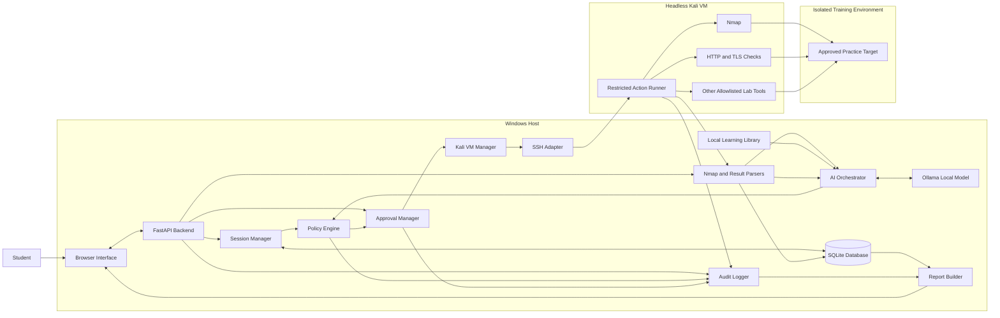
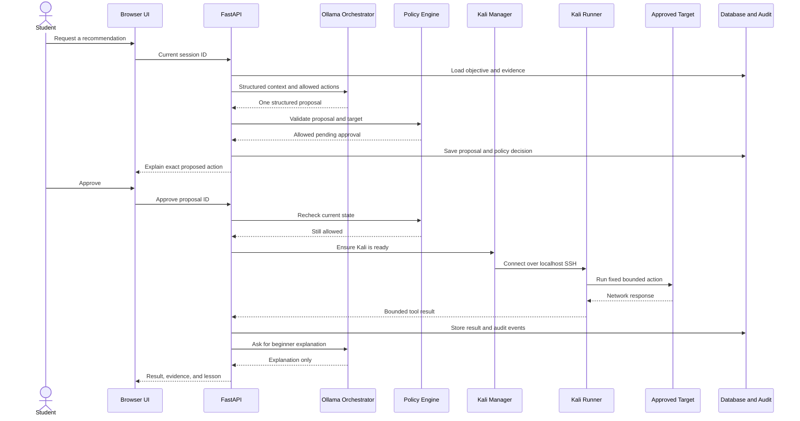

# RedPath Project Connections and Complete Component Guide

## 1. Purpose of this document

This document explains how all parts of RedPath would connect. It covers the Windows host, web interface, FastAPI backend, Ollama, database, headless Kali VM, approved training target, policy controls, tool results, reports, and project files.

RedPath is a learning tool for legal cyber ranges and private practice labs. It is not meant to be an unrestricted autonomous attack system. The AI teaches and recommends. Normal application code checks the rules, the user approves active steps, and Kali only runs fixed actions against an approved target.

## 2. Complete system map



## 3. Where each part runs

| Part | Location | Main responsibility |
|---|---|---|
| Browser interface | Windows | Shows the lesson, evidence, recommendations, approvals, history, and report |
| FastAPI backend | Windows | Provides the application API and coordinates the workflow |
| SQLite database | Windows | Stores sessions, targets, findings, approvals, results, and audit events |
| Ollama | Windows | Runs the local language model |
| Learning library | Windows | Stores reviewed explanations, examples, and safety guidance |
| Policy engine | Windows | Enforces authorization and action rules outside the AI |
| VM manager | Windows | Starts, checks, and gracefully stops Kali |
| SSH adapter | Windows | Sends an approved fixed task to Kali over localhost SSH |
| Headless Kali VM | VirtualBox on Windows | Runs Nmap and other allowlisted security utilities |
| Practice target | Host-only lab or approved range | Receives only the approved training checks |

The core application should stay on Windows. Kali should be treated as a controlled worker, not the main RedPath server. This keeps the user interface and policy controls available even when Kali is stopped.

## 4. Existing headless Kali VM

The current workspace already has a working VM manager. RedPath should reuse it instead of creating another Kali system.

Current VM configuration:

- VirtualBox VM name: `Headless-Kali-Terminal`
- Kali hostname: `kali-headless`
- Vagrant box: `kalilinux/rolling`
- Pinned box version: `2026.2.0`
- Virtual CPUs: `4`
- Memory: `4096 MB`
- Graphical interface: disabled
- Kali private lab address: `192.168.56.10`
- SSH inside Kali: port `22`
- Windows SSH binding: `127.0.0.1`
- Preferred Windows SSH port: `2223`
- Possible Windows SSH port range: `2200-2299`

Vagrant may change the Windows-side SSH port if another VM already uses it. RedPath must read the current SSH configuration after startup. It must never assume that port 2223 was selected.

The VM also has a NAT adapter for updates and a host-only adapter for the isolated lab. SSH is exposed only on Windows localhost, so another device on the local network cannot directly connect to the Kali management port.

The VM disables unnecessary shared folders, shared clipboard behavior, file transfer through the clipboard, X11 forwarding, and fallback SSH-agent keys. These protections should remain enabled.

## 5. Suggested project layers

RedPath should be divided into layers so that no single component controls everything.

```text
Presentation layer
    Browser interface

Application layer
    FastAPI routes
    Session manager
    Approval manager
    Report builder

Reasoning layer
    AI orchestrator
    Ollama provider
    Retrieval library
    Rule-based fallback

Security layer
    Authorization validator
    Target validator
    Action allowlist
    Argument validator
    Rate limiter
    Emergency stop

Execution layer
    Kali VM manager
    SSH transport
    Fixed action adapters

Evidence layer
    Nmap parser
    Tool-result parsers
    Finding classifier
    Database
    Audit log
```

The security layer must sit between reasoning and execution. The AI cannot bypass it.

## 6. Browser interface

The interface is where the student controls RedPath. It should be a normal local website such as `http://127.0.0.1:8000` during early development.

Suggested screens:

### Dashboard

- Create a new lab session.
- Open an earlier session.
- See whether Kali and Ollama are available.
- See the emergency-stop state.

### New session

- Select the training provider.
- Enter the lesson URL.
- Enter the separate target address.
- Describe the lab objective.
- Confirm authorization.
- Choose a session expiration time.

### Evidence workspace

- Import Nmap XML.
- Display hosts, ports, services, and evidence.
- Mark each finding as observed, inferred, or verified.
- Show the original source for each fact.

### Recommendation panel

- Show one suggested next step.
- Explain why it matches the evidence.
- Show the learning goal.
- Show the model confidence as guidance, not proof.
- Show whether the policy accepted or blocked it.

### Approval panel

- Show the exact target.
- Show the fixed action name.
- Show the validated parameters.
- Explain expected network activity.
- Show the timeout and cleanup behavior.
- Provide approve and reject buttons.

### Activity and report

- Stream safe status messages while an action runs.
- Show normalized results when it finishes.
- Explain what changed.
- Create the final learning report.

The browser must not receive SSH private keys, an OpenAI API key, raw database credentials, or permission to run arbitrary commands.

## 7. FastAPI backend

FastAPI connects the user interface to the application services. It should be the only entry point used by the browser.

Suggested route groups:

```text
/api/health
/api/providers
/api/sessions
/api/sessions/{session_id}/targets
/api/sessions/{session_id}/scans
/api/sessions/{session_id}/findings
/api/sessions/{session_id}/recommendations
/api/proposals/{proposal_id}
/api/proposals/{proposal_id}/approve
/api/proposals/{proposal_id}/reject
/api/actions/{action_id}/run
/api/actions/{action_id}/status
/api/sessions/{session_id}/stop
/api/sessions/{session_id}/report
```

FastAPI should use Pydantic models to validate every request and every AI response. Unknown fields should be rejected for security-sensitive objects.

The backend should not accept a route such as `/run-command` with free-form shell text. It should accept only an action ID that already points to a validated, approved database record.

## 8. Session manager

The session manager represents one authorized exercise. A session record should contain:

- Unique session ID.
- User ID.
- Training provider.
- Lesson URL.
- Learning objective.
- Approved target records.
- Creation and expiration times.
- Authorization confirmation.
- Current state.
- Emergency-stop state.
- Kali VM state associated with the session.

Suggested session states:

```text
draft
authorized
ready
running
stopping
completed
expired
blocked
```

When a session expires, the policy engine must block all new actions. Extending it should require another explicit authorization confirmation.

## 9. Lesson link handler

The lesson link gives RedPath context about what the student is learning. It is not the network target.

The link handler should:

- Recognize supported provider domains.
- Store the URL as lesson metadata.
- Extract only information the user is allowed to provide or that the provider exposes appropriately.
- Fall back to manual lesson notes when automatic reading is unavailable.
- Never resolve the lesson website and treat its server as the target.

The database should use separate models and fields for `LessonSource` and `AuthorizedTarget`. This makes it harder to mix them accidentally.

## 10. Authorized target record

Each target record should include:

- Target ID.
- Session ID.
- IP address or approved hostname.
- Target type.
- Allowed address range.
- Allowed protocol or port limits.
- Authorization source.
- Start and expiration time.
- Whether active checks are allowed.

For a local VirtualBox practice lab, a typical layout would be:

```text
Windows host
    Host-only adapter: 192.168.56.1

Kali worker
    Host-only adapter: 192.168.56.10

Practice target VM
    Host-only adapter: 192.168.56.20
```

The exact target address must still be confirmed before use. RedPath should not assume that `192.168.56.20` exists just because it is the suggested example.

## 11. Nmap scan connection

There are two safe ways to obtain a scan.

### Import mode

The user imports an existing Nmap XML file. This is the best starting point because RedPath can demonstrate its reasoning without generating new traffic.

Flow:

```text
Browser uploads XML
        ↓
FastAPI checks file size and type
        ↓
Parser reads XML without executing it
        ↓
Normalized scan and source hash are stored
        ↓
Findings are created as observed evidence
```

### Controlled scan mode

After the target passes policy and the user approves the action, Windows asks Kali to run one predefined scan profile.

Flow:

```text
Approved target record
        ↓
Named scan profile
        ↓
Policy validation
        ↓
User approval
        ↓
SSH adapter invokes fixed Kali runner
        ↓
Runner generates XML in temporary storage
        ↓
Windows retrieves XML
        ↓
Temporary Kali output is cleaned up
```

The model should select a profile name such as `basic_tcp_discovery`. It should not generate arbitrary Nmap flags.

## 12. Scan and result parsers

Parsers convert raw tool output into small, predictable objects.

Example normalized finding:

```json
{
  "id": "finding-12",
  "target_id": "target-3",
  "state": "observed",
  "category": "open_port",
  "protocol": "tcp",
  "port": 80,
  "service_hint": "http",
  "evidence_source": "scan-7",
  "evidence_text": "TCP port 80 reported open",
  "confidence": 1.0
}
```

Tool output should be treated as untrusted data. It can contain unexpected strings that look like instructions. Parsers should extract known fields and the AI prompt should label all tool output as evidence, never as commands for the model to follow.

## 13. Local learning library

The learning library gives Ollama reviewed information. It can begin as Markdown or JSON files and later use embeddings if needed.

Content could include:

- Beginner explanations of ports and services.
- How to read common Nmap fields.
- RedPath action descriptions.
- Safety and authorization rules.
- Lab cleanup guidance.
- Instructor-reviewed examples.
- Common mistakes and misleading evidence.

The retrieval service selects only a few relevant sections for each model request. This reduces prompt size and is easier to maintain than immediately fine-tuning a model.

## 14. Ollama connection

Ollama would run directly on Windows. FastAPI would connect to its local API, normally through a localhost address. The browser should never call Ollama directly.

```text
Browser
   ↓
FastAPI
   ↓
AI orchestrator
   ↓
Ollama provider
   ↓
Ollama localhost API
   ↓
Quantized local instruction model
```

The orchestrator should send:

- A fixed RedPath system instruction.
- The current learning objective.
- Normalized findings.
- Earlier action results.
- Retrieved learning notes.
- The allowed action names.
- A strict JSON schema.

The model returns a proposal, explanation, or question. It does not return executable shell text.

Example proposal:

```json
{
  "finding_ids": ["finding-12"],
  "action_name": "inspect_http_headers",
  "arguments": {
    "target_id": "target-3",
    "port": 80
  },
  "reason": "An HTTP service was observed but has not been checked yet.",
  "learning_goal": "Learn what server headers can reveal.",
  "requires_approval": true
}
```

If Ollama is unavailable, RedPath should display the problem and use a small deterministic rule-based explanation where possible. It should not silently skip validation or grant broader execution rights.

## 15. Optional OpenAI provider

An optional OpenAI provider could implement the same interface as the Ollama provider. This would let the team compare local-model recommendations with a cloud model.

```text
LLMProvider
    OllamaProvider
    OpenAIProvider
    RuleBasedProvider
```

Only the backend may access the API key. Scan context should be minimized before it is sent. The user should know when the cloud provider is selected. Ollama should remain the default for the local-first capstone.

## 16. AI orchestrator

The orchestrator is responsible for using the selected provider correctly. It should:

1. Load the session and normalized findings.
2. Remove unnecessary sensitive details.
3. Retrieve relevant learning notes.
4. List only actions that might apply to the current lesson.
5. Ask the model for exactly one proposed next step.
6. Validate the JSON response.
7. Reject unknown action names and fields.
8. Send the proposal to the policy engine.
9. Save the model response and validation outcome.
10. Show the explanation to the student.

Model confidence is not a security decision. A high confidence value cannot override the policy engine.

## 17. Policy engine

The policy engine is normal Python code with extensive tests. It is the final authority before approval and execution.

It should validate:

- The user confirmed authorization.
- The session is not expired.
- The emergency stop is off.
- The target ID belongs to the session.
- The proposed address exactly matches the approved record.
- The target is private or explicitly supported by a configured training-range policy.
- The action name exists in the allowlist.
- The action is allowed for the current lesson and target.
- Every argument matches the action schema.
- Ports, timeouts, rates, and concurrency remain within limits.
- The proposal has not already run.

The policy result should contain a decision code and human-readable reason:

```json
{
  "allowed": false,
  "code": "TARGET_NOT_AUTHORIZED",
  "reason": "The proposed target does not match this lab session."
}
```

Policy rules should not be hidden inside prompts. They should be visible, versioned, and tested.

## 18. Approval manager

A proposal that passes policy becomes a pending approval record. The user sees the exact target, action, arguments, expected behavior, timeout, and cleanup plan.

The approval should be tied to:

- Proposal ID.
- User ID.
- Session ID.
- Target ID.
- Action name.
- Exact validated arguments.
- Policy version.
- Approval timestamp.
- Expiration timestamp.

Changing any security-relevant value invalidates the approval. The action must return to policy review and user approval.

## 19. Kali VM manager

The VM manager wraps the existing scripts:

```text
vm\KaliVM.cmd status
vm\KaliVM.cmd start
vm\KaliVM.cmd ssh-config
vm\KaliVM.cmd stop
```

RedPath should call the PowerShell implementation directly or use a small Python wrapper that invokes it with fixed arguments. It should not duplicate Vagrant lifecycle logic.

Suggested lifecycle:

1. Check the VM state.
2. Start it only when an approved Kali action needs it.
3. Wait for Vagrant and SSH readiness.
4. Read the actual SSH host, port, user, and identity file.
5. Run the fixed action.
6. Retrieve and parse the result.
7. Stop the VM at session end or after an idle timeout.
8. Verify that Vagrant reports `poweroff`.

The current stop command asks Kali to shut itself down cleanly. Forced power-off should remain a separate manual recovery decision.

## 20. Windows-to-Kali SSH connection

Management traffic follows this path:

```text
RedPath backend on Windows
        ↓
Windows OpenSSH client
        ↓
127.0.0.1:<actual Vagrant port>
        ↓
VirtualBox forwarded port
        ↓
Kali sshd:22
        ↓
Restricted RedPath runner
```

Important rules:

- Read the actual port from Vagrant every time the VM starts.
- Use the per-VM key configured by Vagrant.
- Require `IdentitiesOnly` behavior.
- Do not use password authentication.
- Do not use free-form commands supplied by the browser or model.
- Set a command timeout.
- Capture standard output, standard error, and exit status.
- Limit the amount of output returned to the backend.
- Treat returned text as untrusted evidence.

For a stronger later design, Kali could expose a restricted service or forced-command SSH account that accepts a signed action document. The first MVP can use a fixed Windows command builder as long as inputs are strictly validated and there is no general command endpoint.

## 21. Action registry and adapters

Each action should be registered in code.

Example registry entry:

```yaml
name: inspect_http_headers
runner: kali
risk: low
requires_approval: true
timeout_seconds: 15
allowed_ports: [80, 443, 8000, 8080]
result_parser: http_headers_v1
cleanup: none
```

An adapter should define:

- A stable action name.
- A plain-language description.
- A strict argument schema.
- Required finding types.
- Target restrictions.
- Rate and timeout limits.
- How to run the fixed tool.
- How to parse the result.
- Cleanup behavior.
- Learning notes.

Recommended first adapters:

- Import and parse Nmap XML without network activity.
- Run a limited private-target discovery profile.
- Test a TCP connection on an already observed port.
- Read basic HTTP response headers.
- Inspect a TLS certificate.
- Run an authenticated identity check in a managed SSH lab.

The first version should exclude unrestricted Metasploit control, arbitrary payloads, password guessing, persistence, stealth, evasion, and arbitrary remote shells.

## 22. Kali-to-target network connection

For a local practice target, Kali uses the host-only network:

```text
Kali: 192.168.56.10
        ↓
VirtualBox Host-Only Ethernet Adapter
        ↓
Practice target: example 192.168.56.20
```

The host-only network keeps practice traffic away from the normal home or campus network. The target VM should also use the same host-only network and should not bridge directly to the physical LAN.

TryHackMe and similar ranges may use a VPN or browser-based access method. Support for those environments should be a separate adapter with provider-specific rules. RedPath should not assume that every lesson URL authorizes every IP visible to Kali.

## 23. Result return path

After an action finishes:

```text
Kali tool output
        ↓
Restricted runner result
        ↓
SSH response to Windows
        ↓
Action-specific parser
        ↓
Normalized evidence
        ↓
Database and audit event
        ↓
Ollama explanation
        ↓
Browser display
```

The raw output should be stored only when useful and should have size limits. The normalized result should record where each fact came from.

A successful command does not always verify the original hypothesis. The result parser decides which evidence was actually produced, and the finding service decides whether a finding can move from inferred to verified.

## 24. Observed, inferred, and verified evidence

RedPath should always distinguish:

- **Observed:** Directly reported by a scan or tool.
- **Inferred:** A possible meaning suggested by rules or the AI.
- **Verified:** Confirmed by a separate approved check.

Example:

```text
Observed: TCP port 22 is open.
Inferred: The service may be SSH.
Verified: An approved handshake identified an SSH service.
```

The AI can propose an inference, but it cannot label its own guess as verified.

## 25. Database connections

SQLite is enough for the first version because everything runs for one user on one computer.

Suggested tables:

```text
users
lab_sessions
lesson_sources
authorized_targets
scan_imports
findings
model_requests
model_responses
proposals
policy_decisions
approvals
actions
action_results
audit_events
reports
```

Important relationships:

```text
User 1 ── many LabSessions
LabSession 1 ── many AuthorizedTargets
LabSession 1 ── many ScanImports
ScanImport 1 ── many Findings
Finding many ── many Proposals
Proposal 1 ── 1 PolicyDecision
Proposal 1 ── 0 or 1 Approval
Approval 1 ── 0 or 1 Action
Action 1 ── 1 ActionResult
LabSession 1 ── many AuditEvents
LabSession 1 ── 0 or many Reports
```

Database writes should use transactions when a proposal becomes approved or when an approved action begins. This reduces the chance of an action running without the matching record.

## 26. Audit system

Every important event should be recorded:

- Session created or expired.
- Authorization confirmed.
- Target added, changed, accepted, or rejected.
- Scan imported.
- Model asked for a recommendation.
- Model output accepted or rejected by schema validation.
- Policy decision made.
- User approved or rejected a proposal.
- Kali started or stopped.
- Action started, finished, timed out, or failed.
- Evidence state changed.
- Emergency stop activated or cleared.
- Report generated.

Audit entries should include timestamps, IDs, event type, outcome, and a safe summary. Secrets should never be placed in the audit log.

## 27. Emergency stop

The stop button must work without asking the model.

When activated, it should:

1. Change the session stop flag in the database.
2. Reject all new proposals and actions.
3. Cancel queued actions.
4. Signal the current runner to stop.
5. Close the SSH operation when safe.
6. Record the result.
7. Offer a graceful Kali shutdown.
8. Show anything that may still require manual cleanup.

The emergency stop should be checked before execution and again during long-running tasks.

## 28. Startup sequence

```text
1. Start FastAPI.
2. Open the SQLite database and run schema checks.
3. Load policy and action definitions.
4. Check whether Ollama is reachable.
5. Check the configured local model.
6. Check the Kali manager and Vagrant installation.
7. Read the current Kali state without starting it.
8. Start the browser interface.
9. Show provider and VM health on the dashboard.
```

Kali does not need to start with RedPath. It should start only when a session needs an approved Kali action.

## 29. Normal action sequence



## 30. Shutdown sequence

At the end of a session:

1. Stop accepting new actions.
2. Wait for or cancel the current bounded action.
3. Run adapter cleanup when required.
4. Save final action and cleanup states.
5. Generate the learning report.
6. Ask Kali to shut down gracefully.
7. Verify the VM state is `poweroff`.
8. Keep FastAPI available so the user can read the report.
9. Stop the local RedPath services when the user exits.

## 31. Failure behavior

### Ollama is unavailable

- Keep the session and imported evidence.
- Show a clear provider error.
- Use rule-based explanations if available.
- Do not broaden action permissions.

### Kali fails to start

- Keep the proposal pending or mark the action failed.
- Show the Vagrant error.
- Do not retry continuously.
- Do not change the target or SSH settings automatically.

### SSH disconnects

- Check the VM state.
- Check whether the command timed out or Kali shut down.
- Mark the result unknown until verified.
- Do not report success based only on the connection closing.

### The target stops responding

- Stop the action after its timeout.
- Record the timeout as a result.
- Do not automatically increase scan intensity.

### Model output is invalid

- Reject it.
- Optionally retry once with the schema error.
- Fall back to rules or ask the student for clarification.
- Never execute partial model output.

### Policy rejects a proposal

- Save the rejection code.
- Explain the rule in beginner-friendly language.
- Ask the AI for a safer educational alternative only if useful.

## 32. Secrets and configuration

Configuration should be split into safe settings and secrets.

Safe settings:

- Database path.
- Ollama base URL.
- Local model name.
- Kali workspace path.
- Session timeout.
- Action timeouts.
- Rate limits.
- Approved local lab ranges.

Secrets:

- Optional OpenAI API key.
- Any provider tokens.
- Application session secret.

Secrets should be stored in environment variables or an ignored local secrets file. They should never be committed to Git, sent to the browser, placed in prompts, or written into logs.

The Vagrant SSH configuration should be read through Vagrant when needed. RedPath should not copy the private key into its database.

## 33. Suggested source-code structure

```text
redpath/
├── README.md
├── pyproject.toml
├── .env.example
├── backend/
│   ├── main.py
│   ├── api/
│   │   ├── health.py
│   │   ├── sessions.py
│   │   ├── scans.py
│   │   ├── proposals.py
│   │   ├── actions.py
│   │   └── reports.py
│   ├── models/
│   │   ├── database.py
│   │   ├── requests.py
│   │   └── responses.py
│   ├── services/
│   │   ├── sessions.py
│   │   ├── targets.py
│   │   ├── findings.py
│   │   ├── approvals.py
│   │   ├── reports.py
│   │   └── audit.py
│   ├── ai/
│   │   ├── orchestrator.py
│   │   ├── schemas.py
│   │   ├── retrieval.py
│   │   └── providers/
│   │       ├── base.py
│   │       ├── ollama.py
│   │       ├── openai.py
│   │       └── rules.py
│   ├── policy/
│   │   ├── engine.py
│   │   ├── targets.py
│   │   ├── actions.py
│   │   └── limits.py
│   ├── execution/
│   │   ├── vm_manager.py
│   │   ├── ssh_transport.py
│   │   ├── registry.py
│   │   └── adapters/
│   │       ├── import_nmap.py
│   │       ├── tcp_check.py
│   │       ├── http_headers.py
│   │       ├── tls_certificate.py
│   │       └── ssh_identity.py
│   └── parsers/
│       ├── nmap_xml.py
│       ├── http.py
│       ├── tls.py
│       └── ssh.py
├── frontend/
│   ├── src/
│   │   ├── pages/
│   │   ├── components/
│   │   ├── api/
│   │   └── types/
│   └── package.json
├── knowledge/
│   ├── services/
│   ├── actions/
│   ├── safety/
│   └── examples/
├── policies/
│   ├── actions.yaml
│   ├── local_ranges.yaml
│   └── providers.yaml
├── data/
│   └── .gitkeep
├── tests/
│   ├── unit/
│   ├── policy/
│   ├── parsers/
│   ├── ai_contracts/
│   └── integration/
└── vm/
    └── reference_to_existing_kali_workspace.md
```

The current `KaliVM.ps1`, `KaliVM.cmd`, `Vagrantfile`, `kali-vm.json`, and provisioning script stay together under `vm/`. RedPath can call them through its VM manager.

## 34. Main data contracts

The most important contracts are:

```text
Scan XML -> Normalized Findings

Session + Findings + Learning Notes + Allowed Actions
    -> Model Proposal JSON

Model Proposal + Authorization + Policy Rules
    -> Policy Decision

Approved Proposal
    -> Fixed Adapter Request

Raw Tool Result
    -> Normalized Action Result

Findings + Proposals + Decisions + Results
    -> Learning Report
```

Every boundary should validate its input. The browser cannot create an approved action directly, the AI cannot create a policy decision, and Kali cannot mark its own output as verified evidence.

## 35. Testing plan

### Unit tests

- Nmap XML parsing.
- Target normalization.
- Private-address rules.
- Session expiration.
- Action argument validation.
- Finding-state changes.
- Report generation.

### Policy tests

- Reject public targets.
- Reject targets from another session.
- Reject expired authorization.
- Reject unknown actions.
- Reject extra arguments.
- Reject changed targets after approval.
- Reject execution while stopped.
- Enforce time, rate, and concurrency limits.

### AI contract tests

- Valid proposal schema.
- Invalid JSON rejection.
- Unknown action rejection.
- Evidence citation requirements.
- Correct refusal when evidence is missing.
- Resistance to instruction-like text inside tool output.

### Integration tests

- Start Kali and read the actual SSH port.
- Run a fixed identity action.
- Retrieve a bounded result.
- Gracefully stop Kali.
- Verify the final `poweroff` state.
- Run a controlled check against a disposable host-only target.

### User tests

- Can a beginner separate the lesson URL from the target?
- Can the user explain why a proposed step was chosen?
- Can the user identify observed versus inferred evidence?
- Does the approval screen make the action understandable?
- Does the final report help the user learn instead of only finishing faster?

## 36. Recommended MVP boundary

The first complete demo should use:

- One Windows RedPath application.
- One local Ollama model.
- One existing headless Kali VM.
- One disposable host-only target VM.
- One Nmap XML format.
- Three or four fixed low-risk actions.
- One approval workflow.
- One emergency stop.
- One learning report.

The demo does not need autonomous exploitation or model fine-tuning. A narrow system that connects correctly, explains its choices, and reliably enforces its limits is a stronger capstone than a large unfinished tool.

## 37. Implementation order

1. Create the FastAPI project and SQLite models.
2. Add authorization, target, and session-expiration rules.
3. Add Nmap XML import and finding states.
4. Create the action registry without execution.
5. Connect Ollama through the provider interface.
6. Validate proposals with Pydantic.
7. Add the policy-decision and approval records.
8. Wrap the existing Kali VM status, start, SSH configuration, and stop operations.
9. Add one fixed read-only Kali adapter.
10. Return and parse its result.
11. Add the browser workspace and approval screen.
12. Add audit events and the emergency stop.
13. Add two or three more fixed adapters.
14. Build the final learning report.
15. Test the full workflow with a disposable host-only target.
16. Compare local-model suggestions with reviewed expected answers.

## 38. Final connection summary

RedPath runs mainly on Windows. The browser talks only to FastAPI. FastAPI stores state in SQLite and asks Ollama for structured explanations and proposals. The policy engine checks every proposal with normal code. The user approves the exact action. The VM manager starts the existing headless Kali VM and reads its actual localhost SSH configuration. A fixed adapter runs inside Kali against only the approved practice target. The result returns to Windows, where it is parsed, recorded, explained, and placed in the learning report. At the end, Kali shuts down gracefully and RedPath verifies that it is powered off.

The most important rule is that the model never directly controls Kali. It can suggest a named action, but the policy engine, approval record, fixed adapter, timeout, audit log, and emergency stop remain between the AI and the network.
