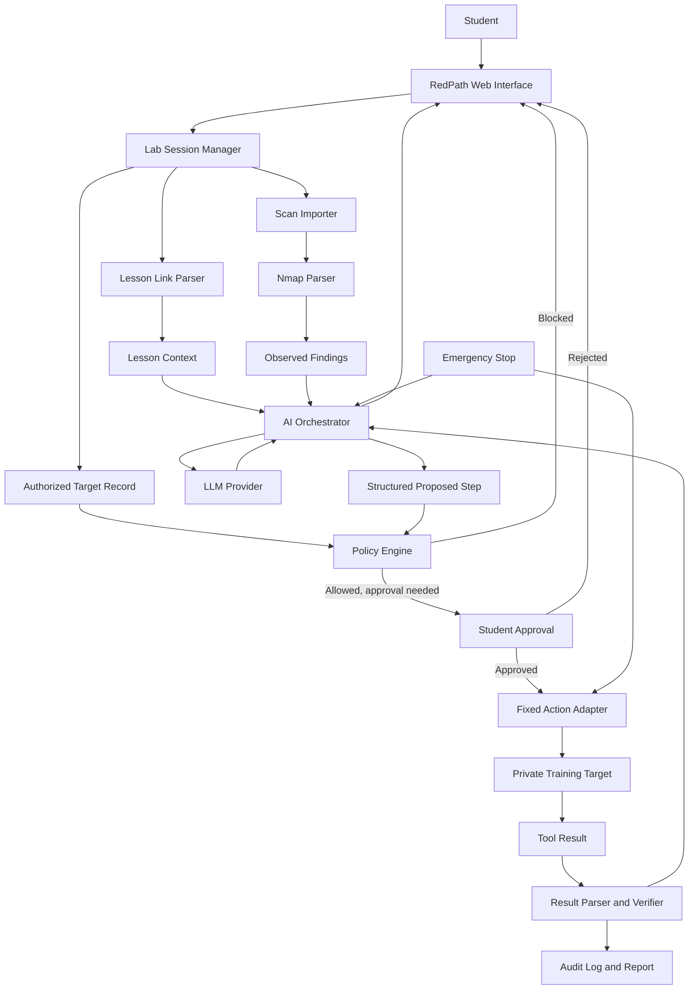

# RedPath System Layout Overview

## 1. Main idea

RedPath would be a beginner-focused red-team learning program for legal cyber ranges and private practice labs. The user gives it a training-room link, the temporary target address supplied by the lab, and scan results such as Nmap XML. RedPath explains what was found, suggests one safe next learning step, waits for approval, and records the result.

The AI should act as a teacher and planner. It should not directly control the computer or have unrestricted terminal access. A separate policy engine must decide whether an action is allowed before anything runs.

## 2. High-level map



## 3. What the user would see

### Start page

The start page would let the student create a lab session. It would ask for:

- The training provider or lab type.
- The lesson link, if one is available.
- The temporary target IP or hostname supplied by the lab.
- A clear confirmation that the user is authorized to test that target.
- An expiration time for the session.

The lesson URL and target address must be stored separately. A TryHackMe page is lesson material. It is not automatically the machine being tested.

### Workspace page

The main workspace could have four sections:

1. **Lesson:** Shows the goal, terms, and hints taken from the lab material.
2. **Evidence:** Shows imported scan results and separates facts from guesses.
3. **Next Step:** Explains what RedPath recommends, why it fits the evidence, and what risk it has.
4. **History:** Shows every approved action, result, explanation, and cleanup step.

### Approval screen

Before an active action runs, RedPath would show:

- The exact target.
- The action category.
- Why the action was suggested.
- What tool will run.
- The expected result.
- The possible risk.
- How the action will stop or be cleaned up.

The user can approve or reject it. Approval should apply only to that exact action, target, and session.

### Final report

At the end, RedPath would create a learning report containing:

- What the student observed.
- What RedPath inferred.
- What was actually verified.
- Which steps worked or failed.
- Why each step mattered.
- Cleanup confirmation.
- Suggested topics to study next.

## 4. Backend layout

### Web interface

A React interface would display the session, findings, explanations, approvals, and report. A simple server-rendered interface could also work for the first demo if React adds too much work.

### FastAPI backend

FastAPI would connect the interface to the rest of the system. Suggested routes include:

- `POST /sessions` to create an authorized lab session.
- `POST /sessions/{id}/scans` to import scan data.
- `GET /sessions/{id}/findings` to view parsed evidence.
- `POST /sessions/{id}/recommendations` to ask for the next learning step.
- `POST /approvals/{id}` to approve or reject a proposed action.
- `POST /actions/{id}/run` to run an already approved fixed action.
- `POST /sessions/{id}/stop` to activate the emergency stop.
- `GET /sessions/{id}/report` to build the final report.

### Database

SQLite would be enough for the first version. PostgreSQL could be used later if multiple students or teams need to share the system.

Main records would include:

- Users.
- Lab sessions.
- Lesson sources.
- Authorized targets.
- Imported scans.
- Findings.
- AI recommendations.
- Approvals.
- Tool actions.
- Results.
- Audit events.

### Scan parser

The scan parser should read Nmap XML instead of relying only on terminal text. It would normalize hosts, ports, protocols, service names, versions, and scan times. The original scan should still be preserved for review.

### Finding states

Every finding should have one of these states:

- **Observed:** Directly present in the scan or tool output.
- **Inferred:** A possible explanation based on the evidence.
- **Verified:** Confirmed by a separate allowed check.

This prevents the model from presenting a guess as if it were proven.

### AI orchestrator

The orchestrator prepares the model input. It should send only the information needed for the current decision:

- The learning objective.
- The authorized target record.
- Parsed findings.
- Earlier approved steps and results.
- Available action names and descriptions.
- The required JSON response schema.

The model should return a structured recommendation rather than a shell command. A response could contain:

```json
{
  "finding_ids": ["finding-12"],
  "recommended_action": "inspect_http_headers",
  "reason": "Port 80 was observed and the HTTP service has not been verified yet.",
  "learning_goal": "Understand what basic HTTP headers reveal.",
  "confidence": 0.82,
  "requires_approval": true
}
```

### Policy engine

The policy engine is the most important security boundary. It must be normal application code, not a prompt sent to the model.

It should check:

- The session is active and not expired.
- The target exactly matches an approved target.
- The destination is private, local, or part of a specifically supported range.
- The action exists in a fixed allowlist.
- The requested arguments match a strict schema.
- The user approved the exact proposed action.
- Rate and concurrency limits have not been exceeded.
- The emergency stop is not active.

The policy engine must reject arbitrary commands, public destinations, target changes, encoded command strings, and unsupported tools.

### Fixed action adapters

An adapter is a small piece of code for one approved task. The model chooses an adapter name, but it does not construct an unrestricted command.

Good first-version adapters include:

- Import an existing Nmap XML file.
- Run a narrowly configured scan against the approved private target.
- Check whether an HTTP page responds.
- Read HTTP response headers.
- Inspect a TLS certificate.
- Confirm that a TCP port accepts a connection.
- Run an authenticated SSH identity command such as `whoami`, `hostname`, or `id` in a managed lab.

Unrestricted Metasploit execution, arbitrary payload generation, credential guessing, persistence, and stealth should not be part of the first version.

### Audit logger and emergency stop

The audit logger records the user, session, target, proposal, approval, adapter, arguments, timestamps, result, and cleanup status. The emergency stop prevents new actions and attempts to stop currently running adapters.

## 5. Model choices

### Option A: Ollama local model

Ollama is the best default for the RedPath capstone because the project is supposed to use a local model. Scan results and lab details can stay on the computer, there is no per-request API charge, and the project can still work when internet access is limited.

This computer has an AMD Ryzen AI 9 HX 370, about 32 GB of RAM, and an RTX 4060 Laptop GPU with about 8 GB of VRAM. That should be suitable for testing a quantized 7B or 8B instruction model. A larger model may run partly in system memory, but it will be slower.

Ollama supports tool calling and structured output, which fits the proposed-action design. RedPath should still validate every model response with Pydantic and send the proposal through the policy engine.

Advantages:

- Keeps sensitive lab context local.
- No normal API cost.
- Works offline after the model is downloaded.
- Easier to demonstrate the local-AI part of the project.
- Can expose an OpenAI-compatible local endpoint.

Disadvantages:

- Smaller local models may misunderstand incomplete scan evidence.
- Tool selection and JSON consistency need more testing.
- Responses may be slower than a cloud model.
- Model quality depends on the available hardware and selected quantization.

### Option B: OpenAI API

There is not a general-purpose "Codex key" that should be copied out of the Codex app and placed into RedPath. The application would instead use an OpenAI project API key and call a supported model through the OpenAI API, normally through the Responses API.

Advantages:

- Usually stronger reasoning and instruction following.
- Reliable structured responses and function-calling support.
- Easier baseline for comparing local-model quality.

Disadvantages:

- API usage can cost money.
- The computer needs internet access.
- Scan and lab context is sent to an external service unless it is removed or minimized first.
- The API key must be stored on the backend and never placed in browser code or committed to Git.

### Recommended design: provider interface

RedPath should support both through one small interface:

```text
LLMProvider
  recommend_next_step(context, allowed_actions) -> ProposedStep
  explain_result(context, result) -> Explanation

Implementations
  OllamaProvider
  OpenAIProvider
  RuleBasedProvider
```

Use `OllamaProvider` as the normal capstone mode. Use `OpenAIProvider` only as an optional comparison or fallback. Keep `RuleBasedProvider` so the demo can still produce basic prioritization if the model is unavailable.

## 6. Should the Ollama model be trained?

The first version should not start with fine-tuning. It would take extra time, require a good training dataset, and could make mistakes harder to understand. Fine-tuning also does not replace the policy engine.

Start with these levels:

### Level 1: Prompt and schema

Give the model a clear role, a short list of allowed action names, examples, and a strict JSON schema. Reject invalid output and retry once with the validation error.

### Level 2: Retrieval

Create a small local knowledge base containing:

- Explanations of common ports and services.
- RedPath safety rules.
- Approved adapter documentation.
- Beginner lesson notes.
- Known scan examples with instructor-written explanations.

Retrieve only the relevant sections for each request. This is easier to update than training model weights.

### Level 3: Example library

Build a reviewed collection of inputs and expected recommendations. Use it for few-shot examples and automated evaluations. Include cases where the correct answer is to ask for more evidence or refuse an action.

### Level 4: Optional LoRA fine-tuning

Only consider a small LoRA adapter after the prompt-and-retrieval version has been evaluated. Training data should contain reviewed scan summaries, correct finding states, safe next-action choices, explanations, refusals, and cleanup guidance. Split the dataset into training and test sets so the final evaluation does not reuse training examples.

Ollama can load a compatible fine-tuned adapter through a Modelfile, but the adapter normally has to be trained with a separate fine-tuning framework. This should be treated as an advanced feature, not a requirement for the capstone MVP.

## 7. Recommended MVP flow

```text
Create authorized session
        ↓
Enter lesson link and separate target
        ↓
Import Nmap XML
        ↓
Parse observed findings
        ↓
Retrieve matching learning notes
        ↓
Ask Ollama for one structured recommendation
        ↓
Validate JSON and check policy
        ↓
Explain proposal and request approval
        ↓
Run one fixed adapter
        ↓
Parse and classify the result
        ↓
Explain what changed
        ↓
Write audit event and final learning report
```

## 8. Build order

1. Define the database models and authorization record.
2. Build the target validator and policy tests.
3. Add Nmap XML import and normalized findings.
4. Create the LLM provider interface.
5. Connect Ollama and require structured JSON.
6. Add the first three fixed read-only adapters.
7. Build the approval page and emergency stop.
8. Add retrieval from reviewed lesson notes.
9. Create the report and observed/inferred/verified view.
10. Compare Ollama recommendations against instructor-approved answers.
11. Add the optional OpenAI provider if time allows.
12. Consider fine-tuning only after the evaluation shows a repeated problem that examples and retrieval do not solve.

## 9. Final recommendation

Use Ollama first. It matches the local-LLM goal, keeps the project easier to explain, and should work reasonably well on this computer with a quantized 7B or 8B model. Do not slightly train it at the beginning. Use a strong system prompt, structured output, reviewed examples, and a small retrieval library first.

Add OpenAI as an optional provider for quality comparison. Use a normal OpenAI project API key for that provider, not a key taken from Codex. No matter which model is selected, the model should only recommend named actions. The policy engine and the user must stay in control of execution.
